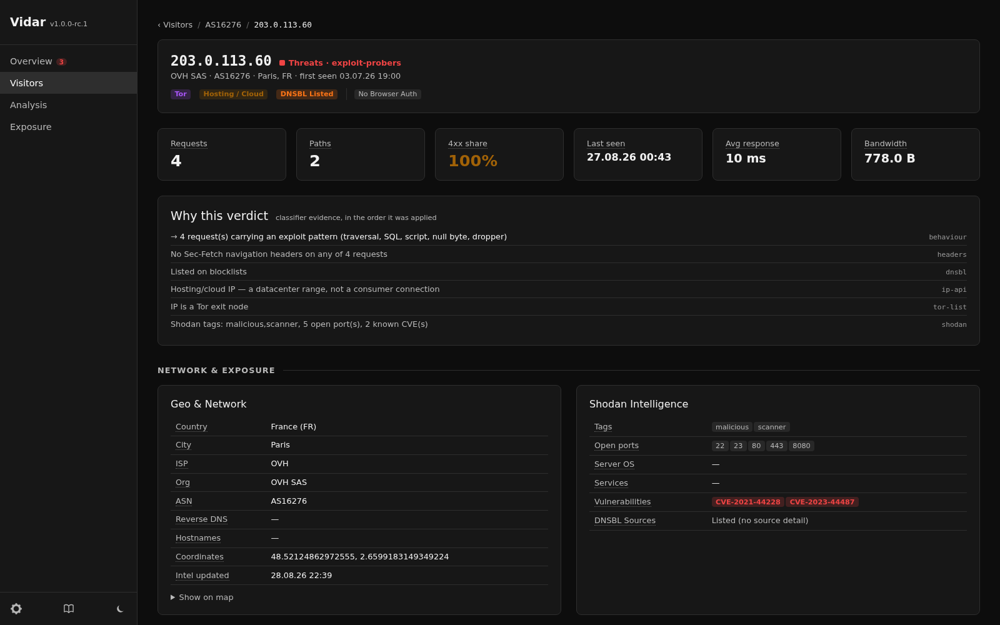
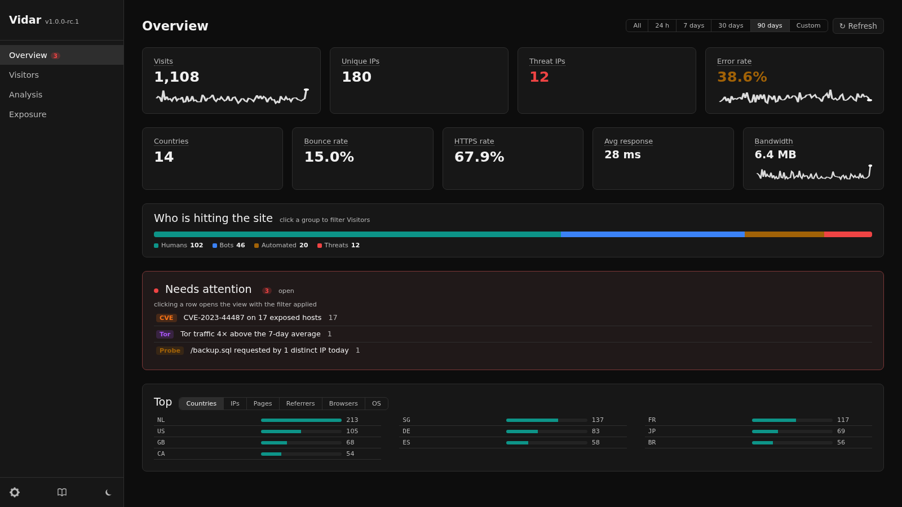
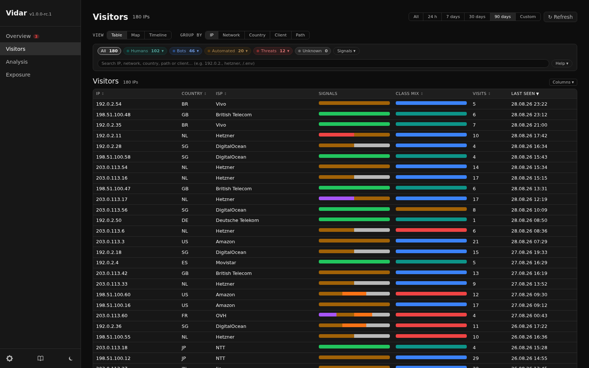
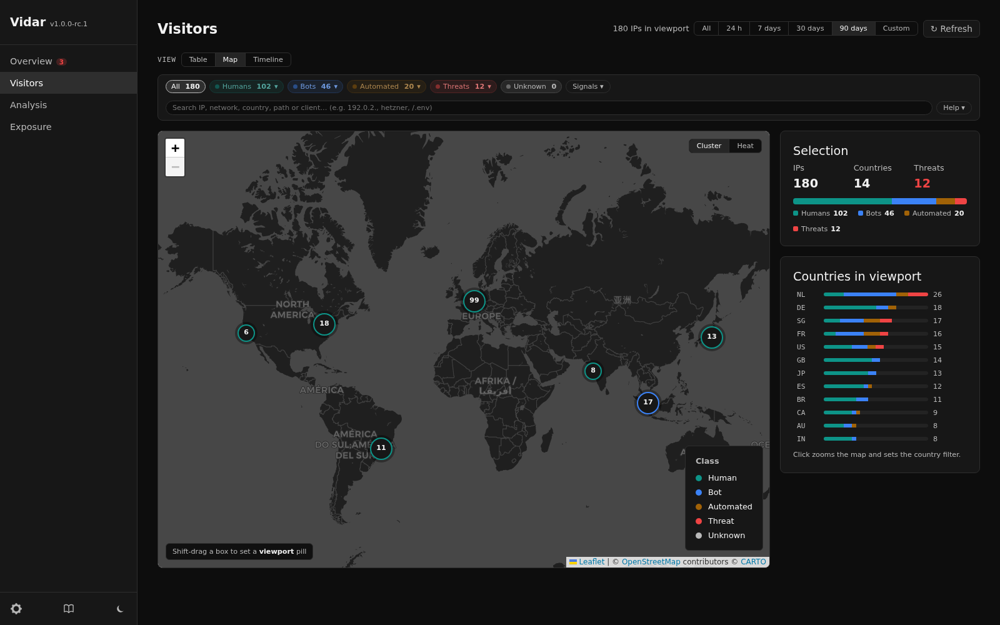
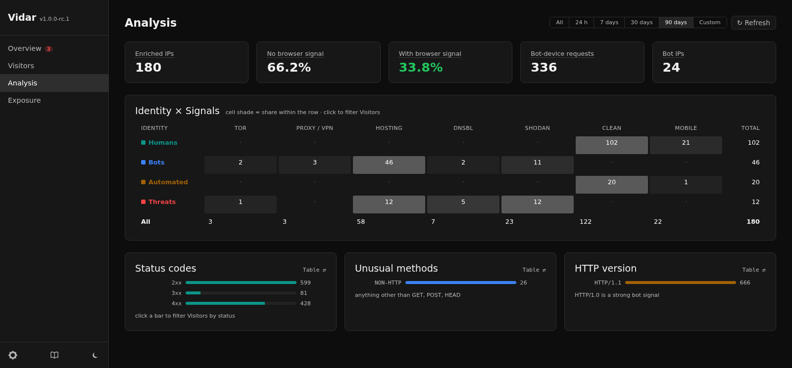
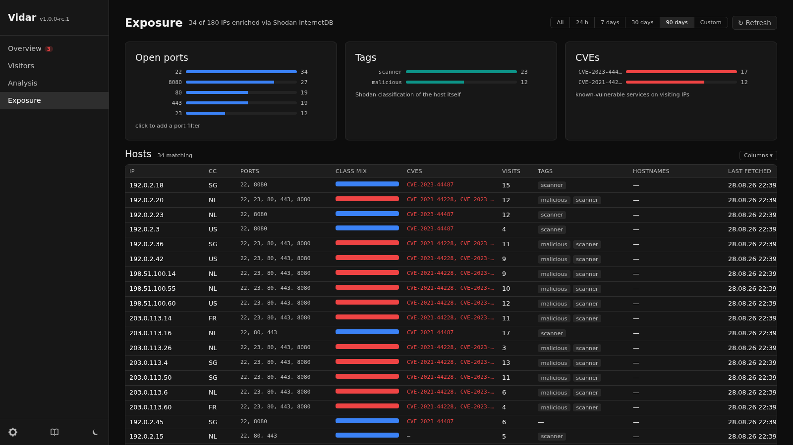

<div align="center">

# Vidar

**Passive visitor intelligence for a single web server**

[](https://github.com/KrisMyslowski/Vidar/actions/workflows/ci.yml)
[](LICENSE)
[](docs/changelog.md)
[](https://www.python.org/)

[](https://fastapi.tiangolo.com/)
[](https://www.sqlite.org/)
[](https://www.docker.com/)
[](#the-idea)
[](https://claude.com/claude-code)

</div>

Vidar reads Nginx access logs and turns raw HTTP requests into a structured account of who —
and what — is reaching the site.

Nothing is added to the observed site: no script, no cookie, no client-side tracking. The log
was already being written. Vidar parses it, enriches each IP from public sources, classifies
the visitor, and serves the result on a dashboard bound to loopback and reachable only through
an SSH tunnel.



> Every screenshot on this page comes from synthetic traffic. All addresses are from the
> RFC 5737 documentation ranges, so no real visitor appears here.

---

[The idea](#the-idea) · [The surfaces](#the-surfaces) · [How it works](#how-it-works) ·
[Stack](#stack) · [Running it](#running-it) · [Documentation](#documentation) ·
[License](#license)

---

## The idea

Most log analysers answer "how many". Vidar is built around a harder question: **what kind of
client was that, and what is the evidence?**

Two things follow from taking that seriously.

**Identity and reputation are separate dimensions.** `visitor_class` answers *who* the visitor
is — a person, a search crawler, a scanner, an HTTP client. Tor, proxy, hosting and blocklist
status are **orthogonal signals** layered on top. A person behind a VPN stays a human with a
proxy signal, rather than disappearing into an "infrastructure" bucket the way a single-axis
taxonomy forces. 18 identity classes in 5 groups, six signals, and any combination of the two.

Holding that line takes work: a VPN exit and a rented server are the same datacenter range
seen from here, so identity has to be decided on what the address did rather than on where
it sits.

**A verdict has to show its work.** Every classification is derived from a deterministic
priority chain over evidence pulled from the visit history, and the detail page replays that
chain in the order it was applied — deciding rule first, then the context that did not decide
it — which is the page at the top of this README.

The chain is behaviour-first: a malicious or bot-like action outranks a browser-look, and
reputation alone never downgrades a real person.

---

## The surfaces

### Overview

Nine figures for the selected range — visits, unique IPs, threat IPs, error and
bounce rates, HTTPS share, countries, mean response time, bandwidth — over the
activity chart and the busiest addresses.



### Visitors

One page for every way of slicing the same data. Group by IP, network, country, client or
path; switch between table, map and timeline. Each row carries a proportional class mix and
signal bar rather than a single badge, so an aggregate row shows its composition instead of
its majority.



Search is field-aware: `country:DE`, `ua:wget`, `tag:scanner`, `port:22`, `status:4xx`, or a
bare term matched by shape — two letters are a country, `AS…` a network, a leading `/` a path.

### Map

Markers coloured by identity group, clustered or rendered as a density grid. The selection
panel recomputes from whatever is inside the viewport, so panning *is* the selection.



### Analysis

The Identity × Signals matrix is the taxonomy made legible: who the visitors are against what
their networks carry. Every cell links to the IPs behind it.



### Exposure

What Shodan knows about the hosts that visited — open ports, tags and CVEs as facets over the
same host set, so a facet always describes the table beneath it.



---

## How it works

```
nginx access log (JSON)
  -> tail_log()            parse, filter noise, insert visits, queue new IPs
  -> enrichment_worker()   ip-api - Shodan InternetDB - DNSBL - Tor exit list
  -> classify_ip()         evidence query, then a deterministic priority chain
  -> FastAPI               server-rendered dashboard + JSON API
```

Everything runs in one asyncio event loop inside one container: the log tailer, the enrichment
worker, and the daily retention, archive and backup passes. There is no cron, no queue broker
and no second service.

Storage is a single SQLite file in WAL mode. Retention is a calendar window — the current month
plus the last N — and a month that falls out is written to a zip **before** its rows are
deleted, never after.

---

## Stack

Python 3.12, FastAPI, Jinja2, SQLite, markdown-it-py. Docker with a read-only root
filesystem, a non-root user, `no-new-privileges`, and a loopback-only port. A per-request
CSP nonce, so the dashboard carries no inline handlers.

No frontend build step and no chart library: bar rows, day columns, mix bars and heat grids are
CSS, and inline SVG covers what CSS cannot. Leaflet is the only visualization dependency.

Enrichment uses free tiers throughout and needs no API key, except Spamhaus, which requires a
free DQS key before it returns anything. Those tiers carry conditions — ip-api's free endpoint
is non-commercial use only — and [deployment_detail.md](docs/deployment_detail.md) lists each provider's
limit, terms, and what degrades if you leave it out.

---

## Running it

To see it before installing anything, `DEMO_MODE=true` needs no server, no nginx and no mount:

```bash
docker run --rm -p 127.0.0.1:8080:8080 -e DEMO_MODE=true ghcr.io/krismyslowski/vidar:1.0.0
```

Synthetic traffic, classified by the real classifier, with a banner on every page saying so.
From a checkout, `DEMO_MODE=true DB_PATH=/tmp/demo.db uvicorn src.main:app --port 8080` does
the same.

For a real site there are two routes, both in [deployment_tldr.md](docs/deployment_tldr.md):

- **From the published image** — two files in an empty directory on the server, then
  `docker compose up -d`.
- **From a checkout** — `./deploy/deploy_remote.sh`, which is the one to use if you intend to
  change the code.

Either way the host is prepared first: nginx writing the JSON log format, a directory the
container can read it from, and the `.env`. That preparation is where a first install actually
goes wrong — not the deploy.

Once it is up, the dashboard binds `127.0.0.1:8080` and is not exposed to the internet:

```bash
ssh -L 8080:localhost:8080 <user>@<host>
```

Then open `http://localhost:8080`.

Three settings describe the *watched site* rather than the service — `SITE_BASE_URL`,
`STATIC_ASSET_PREFIXES` and `JS_ONLY_PATH_PREFIXES`. They ship empty, because no default is
right for a second deployment; unset, each one switches its signal off rather than guessing.
See [.env.example](.env.example).

---

## Documentation

| Document | For |
|---|---|
| [architecture.md](docs/architecture.md) | how the service is built, and why |
| [data-reference.md](docs/data-reference.md) | every log field, table, classifier rule and setting |
| [usage.md](docs/usage.md) | operating the dashboard |
| [privacy.md](docs/privacy.md) | what is stored, what leaves the server, what the operator owns |
| [deployment_tldr.md](docs/deployment_tldr.md) | install, configure, run — the whole thing, tersely |
| [deployment_detail.md](docs/deployment_detail.md) | the same ground with the reasoning and the traps |
| [api.md](docs/api.md) | the JSON endpoints |
| [testing.md](docs/testing.md) | the suites and what each protects |
| [changelog.md](docs/changelog.md) | what changed, and when |
| [CONTRIBUTING.md](CONTRIBUTING.md) | setting up, the gates, the conventions |
| [SECURITY.md](SECURITY.md) | reporting a vulnerability |

Every document above describes the system as it is now. Superseded reviews and closed backlogs
are not kept in the tree.

---

## License

MIT — see [LICENSE](LICENSE).
