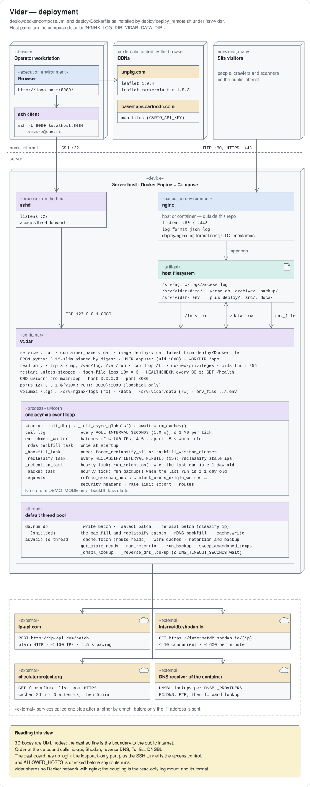
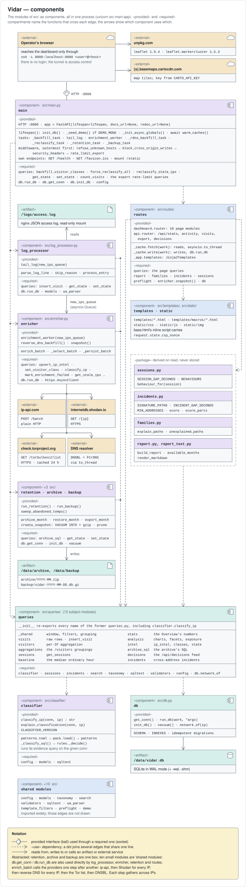
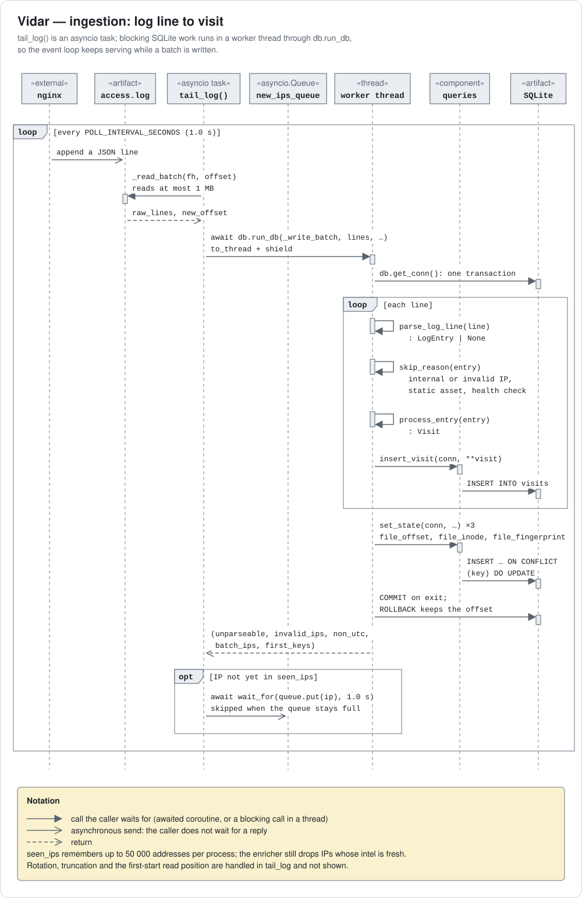
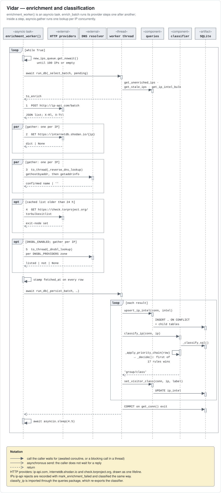
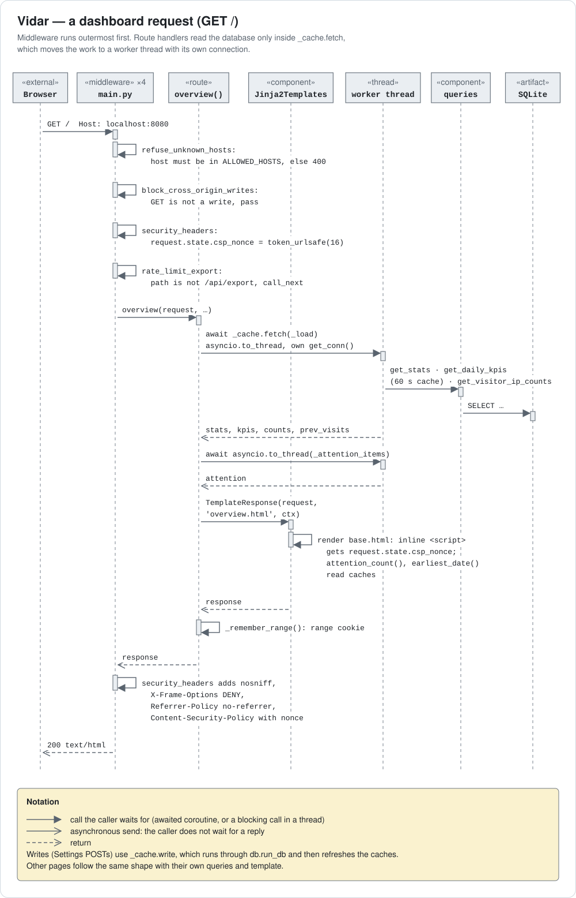
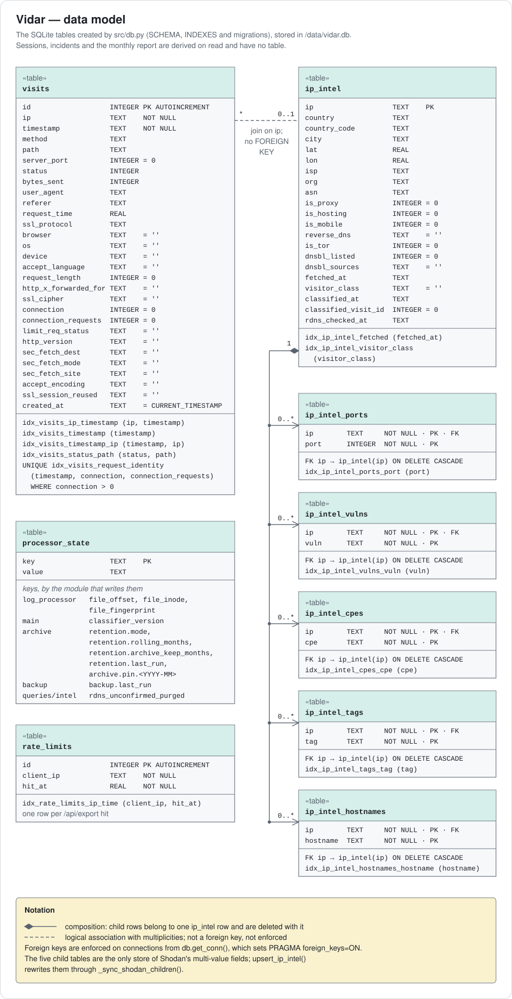
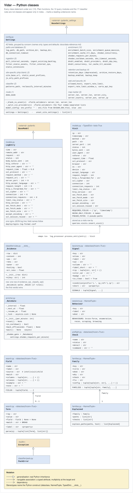

# Architecture

For developers changing the service. Operators want [deployment_tldr.md](deployment_tldr.md); the
authoritative field-by-field reference is [data-reference.md](data-reference.md).

Vidar is a single-container Python service that passively observes Nginx access logs,
enriches visitor IPs with public geo and threat data, classifies each IP, and serves a
local-only analytics dashboard. `vidar` is the technical name — container, compose service,
database file and logger namespace all use it.

---

## 1. Deployment shape



The diagrams in this document are generated, not drawn by hand: edit
`scripts/make_diagrams.py` and run `python3 scripts/make_diagrams.py docs/diagrams`. Each one
names the code it describes, so a rename there is a rename here.

nginx is outside this repository — on the host or in a container of its own, but never on a
Docker network shared with Vidar. The only coupling is a read-only bind mount of the log
directory, plus the log format itself —
`deploy/nginx-log-format.conf` is the authoritative contract, and any change to the
fields nginx emits must land in `src/models.py` (`LogEntry`), the `visits` DDL in `src/db.py`
and [data-reference.md](data-reference.md) together.

**A log format is one source's way of writing a request down, and `src/models.py` keeps that
separate from what a request *is*.** `Visit` is the canonical event — the vocabulary the
database columns, the evidence query, the classifier and the templates all use. `LogEntry` is
nginx's spelling of the same thing, and `process_entry()` is the single place where one becomes
the other. A second log format is a second mapping there and nothing else.

Most of what looks like a vendor field is not: `sec_fetch_*` and `accept_encoding` are HTTP
headers, `ssl_protocol` and `ssl_cipher` are TLS facts, and any web server can log them.
`NGINX_ONLY_FIELDS` names the four that genuinely cannot travel — the connection counters, the
rate-limit status and TLS session reuse. `tests/test_canonical_event.py` holds all of this to
the code, because a `TypedDict` is documentation at runtime and Python enforces none of it.

### Container isolation

| Layer | Mechanism |
|---|---|
| Network | Bound to `127.0.0.1:8080`; unreachable from the internet, SSH tunnel required |
| Filesystem | `read_only: true`; logs mounted `ro`; only `/data` writable |
| Privileges | `no-new-privileges: true`, every capability dropped, a PID ceiling, runs as non-root `appuser` |
| Browser | Per-request CSP nonce, `X-Frame-Options: DENY`, `Referrer-Policy: no-referrer` |
| Input | Log lines parsed through Pydantic; every query parameterised |

There is **no authentication**. The service binds loopback and is reached over SSH, which
covers the network but not the browser at the tunnel's end — a form POST is a simple request,
so any page the operator has open could send one. `form-action 'self'` and the CSRF checks in
`main.py` are what constrain that; see the cross-origin notes there.

---

## 2. Runtime



Everything is coordinated by **one asyncio event loop**, with no inter-process communication
except one queue. SQLite is synchronous, so **no database work runs on the loop itself**:
the tailer and the enricher hand theirs to `db.run_db()` (a worker thread, shielded so a
cancelled task cannot leave a write running), routes read through `_cache.fetch()` and write
through `_cache.write()`, and the lifespan tasks below use `run_db()` or `asyncio.to_thread`.
Blocking DNS lookups run on worker threads too. `tests/test_background_tasks_stay_off_the_loop.py`
holds the lifespan tasks to it.

1. **`tail_log()`** (`src/log_processor.py`) polls the log every `POLL_INTERVAL_SECONDS`,
   reads at most 1 MB per tick, parses each line as JSON, drops noise (RFC1918 and loopback
   IPs, static assets, health-check agents), inserts visits, and pushes novel IPs onto an
   `asyncio.Queue`. Rotation is detected by inode change, truncation by offset exceeding file
   size. The byte offset and inode live in `processor_state`, so a restart resumes rather than
   re-reads.

2. **`enrichment_worker()`** (`src/enricher.py`) drains that queue, tops it up with stale rows
   from the database, and calls the providers below one step after another — ip-api, Shodan,
   reverse DNS, the Tor list, the DNSBLs — each step concurrent across the batch's IPs. It writes `fetched_at` only after a
   batch completes, so partial enrichment is never persisted, and finishes each IP with
   `set_visitor_class(conn, ip, classify_ip(conn, ip))`.

3. **Periodic and one-off work** runs as lifespan tasks next to those two, all in-process.
   At startup the classifier backfill reclassifies every IP once when `CLASSIFIER_VERSION`
   changed (otherwise it only fills IPs with no class yet), and the reverse DNS backfill looks
   up addresses enriched before reverse DNS was resolved locally; both exit when done. Then:
   `_reclassify_task` re-judges IPs that stayed active after being classified, every
   `RECLASSIFY_INTERVAL_MINUTES` (default 15); `_retention_task` and `_backup_task` run once
   a day. Backup is a separate task rather than a step inside the retention pass, because
   retention only does work in `rolling` mode and a snapshot must not stop because someone
   switched to `lifetime`. A failed pass must never kill its loop.







> **There is no cron in this container, deliberately.** There was: a `/etc/cron.d` entry that
> never fired once, because the Dockerfile also installed the same system-format file as
> root's personal crontab and the working entry redirected to `/proc/1/fd/1`, which the
> non-root user cannot open. The shell died before Python started, silently, because cron's
> stderr goes nowhere in a container. Production reached 123 days of data under a 90-day
> policy before anyone noticed. Anything periodic belongs in the lifespan, where it runs as
> the same user and logs to `docker logs`.

### Enrichment providers

| Provider | Transport | Limit | Notes |
|---|---|---|---|
| ip-api.com | HTTP (free tier) | paced at 13 batches/min against a 15/min ceiling, honours `X-Rl`/`X-Ttl` | Batch of up to 100 IPs |
| Shodan InternetDB | HTTPS | Rate-gated, 10 concurrent | Per IP; no API key |
| DNSBL | DNS | Semaphore-bounded | `zen.spamhaus.org`, `bl.spamcop.net`; IPv4 dotted-quad and IPv6 nibble reversal (RFC 5782) |
| Reverse DNS | DNS | Same semaphore as the DNSBLs | Forward-confirmed (PTR, then the name must resolve back to the IP); an unconfirmed name is discarded, not stored |
| Tor exit list | HTTPS | Once per 24 h | ~7 KB, cached in memory as a set; three attempts per call, then a 5-minute pause during which the previous list is kept |

**These providers and the resolver the container is configured with are the service's only
runtime dependencies beyond the log file**, and
their endpoints are module constants in `enricher.py` (`BATCH_URL`, `SHODAN_URL`,
`TOR_EXIT_URL`) rather than settings — they identify the services Vidar integrates with, not
something an operator tunes. Every one is optional in the sense that failure degrades
enrichment without stopping ingestion, and only the IP itself is ever sent. The dashboard
additionally loads Leaflet from unpkg and map tiles from `basemaps.cartocdn.com`; those are
the only browser-side external requests, and the CSP names them explicitly.

Two provider behaviours are load-bearing and easy to break:

- **A silent Shodan lookup is not an empty answer.** `_fetch_shodan()` returns `None` when
  Shodan did not answer at all (timeout, 429, 5xx, unparseable) and a dict when it did,
  empty values included. The caller writes answers straight through to child tables that
  delete before they insert, so conflating the two once wiped the ports, CVEs, CPEs and tags
  of every IP in a batch.
- **A DNSBL that resolves is not a listing.** The *value* is the answer: `127.0.0.2–.11`
  means listed, `127.255.255.x` is an error code. Spamhaus answers `127.255.255.254` to every
  query arriving through a public resolver, so treating "it resolved" as "it is listed" marks
  essentially every IP. `_dnsbl_lookup()` returns `True`/`False`/`None` accordingly and
  `_warn_dnsbl_error()` reports the misconfiguration once per provider.
  **Without `DNSBL_DQS_KEY` the free zone refuses us and the signal carries no data at all.**

---

## 3. Data model

SQLite in WAL mode: one writer, concurrent readers, so dashboard reads never block ingestion.
`get_conn()` is the only way to open a connection outside `init_db`/`vacuum` — it sets WAL,
`foreign_keys=ON`, a row factory, and commits or rolls back around the block.





| Table | Rows | Purpose |
|---|---|---|
| `visits` | one per request that survived filtering | 29 columns; the raw record |
| `ip_intel` | one per unique IP | 21 columns; enrichment cache plus `visitor_class` |
| `ip_intel_{ports,vulns,cpes,tags,hostnames}` | one per value | the **sole** store for Shodan multi-value fields |
| `processor_state` | key/value | tail position, classifier version, retention and backup bookkeeping, one-off repair flags — every key in [data-reference.md §2.3](data-reference.md#23-processor_state-keyvalue) |
| `rate_limits` | one per `/api/export` hit | so the limit survives a restart |

The five child tables carry `ON DELETE CASCADE` from `ip_intel` and replaced comma-separated
columns, which were dropped. `upsert_ip_intel` writes them via `_sync_shodan_children`; reads
re-aggregate with `GROUP_CONCAT` for display and filter directly for `/shodan?port=&vuln=&tag=`.
This is what makes "every host with port 22" a query instead of a `LIKE` scan.

### Visit identity

`visits` carries a **partial unique index** that deduplicates crash replays without
collapsing genuine traffic:

```sql
CREATE UNIQUE INDEX idx_visits_request_identity
    ON visits(timestamp, connection, connection_requests) WHERE connection > 0;
```

`$time_iso8601` resolves only to the second, so `(time, ip, request)` cannot distinguish two
identical requests in one second from one request ingested twice — a unique constraint over
those would silently drop real visits. nginx's `$connection` plus `$connection_requests`
numbers a request uniquely for the life of the process, which supplies the missing part. The
index is partial on purpose: rows written before the field existed carry `connection = 0`
and would otherwise all collide on `(timestamp, 0, 0)`.

---

## 4. Classification

`visitor_class` is **identity only** — who the visitor is. Network and reputation facts (Tor,
proxy, hosting, DNSBL, Shodan tags) are **orthogonal signals**, stored as their own columns
and filtered with `?signal=`. A human on a VPN is `humans/*` *plus* a proxy signal, not an
infrastructure class.

The logic lives in `src/classifier/`, split out of the SQL layer: `patterns.py` holds the
thresholds and `CLASSIFIER_VERSION`, `patterns.toml` the needles and `pack.py` their
  loading, `evidence_sql.py` the one query summarising an IP's
history, `rules.py` the ordered chain, `classify.py` the two entry points needing a
connection. Writing a class back to `ip_intel` is SQL and stays in `queries/intel.py`.

The chain is behaviour-first: a malicious or bot-like action outranks a browser-look, and
reputation never downgrades a real human on its own. `is_hosting` is the single reputation
field it reads, and only to name a different object rather than demote one — a browser on
cloud compute is `automated/headless-browser`, a crawler UA on a cloud IP that nothing
about its origin supports is `bots/impersonators`.

Both of those were too blunt until v6, and in the same way: a flag was standing in for
evidence it does not carry. `is_hosting` cannot tell a rented server from a commercial VPN
exit, so every person browsing over a VPN was automation; reverse DNS covers 42% of
addresses and none of OpenAI, Anthropic or DuckDuckGo, so 88 of 91 impersonators were the
crawler they claimed to be. Behaviour decides the first now (`_reads_like_a_person()`), the
network owner the second (`_CRAWLER_ORIGINS`).

18 classes in 5 groups: `humans` (3), `bots` (8), `automated` (4), `threats` (2), `unknown`.
`src/taxonomy.py` (`VISITOR_CATEGORIES`) is the single source of truth; class strings always
carry the group prefix.

### Behaviour, the third axis

Identity says what an address *is* and the signals where it *sits*; neither says what it *did*.
Behaviour does, and it is orthogonal to both — a person can scrape and a search crawler can
enumerate, and the priority chain should not have to crown a winner between them.

Behaviour belongs to a **session**, not an address: one address can read two pages in the
morning and walk a scanner list at night. `src/sessions.py` cuts an address's visits at
`SESSION_GAP_SECONDS` of silence and labels each session — browsing, scraping, recon,
enumeration, brute force, or nothing when there is too little to say. Pages are counted as the
classifier counts them: a path up to its query string, protocol errors excluded.

**Sessions are derived when they are read, never stored.** Sessionising one address is cheaper
than the evidence query already run beside it, because `idx_visits_ip_timestamp` hands the rows
over in order. Not storing them means no migration, no backfill, and no session left stale when
a month is re-imported from an archive with its original visit ids.

Three surfaces build on sessions without storing anything either:

- **Incidents** (`src/incidents.py`, SQL in `queries/incidents.py`) — sessions across
  addresses that ran the same program. A signature is the first `SIGNATURE_PATHS` missing paths
  a session asked for, in order; sessions sharing one, each starting within
  `INCIDENT_GAP_SECONDS` of the last, are one incident once `MIN_ADDRESSES` took part. The
  thresholds err towards under-reporting, and their measurements sit beside them in the module.
  The sort key is a sum of named weights, not a measurement, and the page prints its arithmetic.
- **The hourly baseline** (`queries/baseline.py`) — the median hour over the last
  `BASELINE_DAYS`, hours with no traffic counted as zero, which is what "unusual" on the
  Overview is measured against. A median rather than a mean, so one busy day does not hide the
  next; and no answer at all under `MIN_BASELINE_DAYS` of history.
- **Families** (`src/families.py`) — what an Exposure finding *is* and how to stop serving it,
  keyed by kind of file rather than by path. Explanation only: detection never consults it.

The monthly report (`src/report.py`) is assembled from these and from the queries the pages
already run. It computes nothing a second way, because a report that disagreed with the
dashboard beside it would be the one nobody believed.

Three invariants worth stating because each has been broken:

- **Extending the patterns or the providers means forking, and that is the supported answer.**
  Neither is a registration point, for reasons that are not stylistic. The classifier's pattern
  tuples are compiled into SQL fragments at import (`_SCANNER_PATH_MATCH` and friends), so a
  configurable list means operator input inside a statement — and the one place that already
  did that had to be fixed. Configuration also has no version to bump: a changed rule makes
  every stored label stale, which is what `CLASSIFIER_VERSION` exists to catch, and a pattern
  list edited in a `.env` would change the rules and leave the verdicts computed under the old
  ones. The four enrichment providers are likewise not four URLs but four contracts —
  `_fetch_shodan()` separates "did not answer" from "answered emptily" because the caller
  deletes before it inserts, and a DNSBL that resolves is not a listing. An interface
  expressing all of that would be harder to implement correctly than the function it replaced.
  Fork `patterns.py` or `enricher.py`; both are single files with clear seams.
  `DNSBL_PROVIDERS` is the one genuine exception, and it is already a setting, because a DNSBL
  zone is a hostname with a uniform protocol behind it.
- **A logic change must bump `_RULES_VERSION`** (`src/classifier/patterns.py`), and a needle
  change moves the pack digest half of `CLASSIFIER_VERSION` on its own. Startup
  then runs `force_reclassify_all()` once, made idempotent by a version flag in
  `processor_state`. It costs less than the phrase "reclassify every address" suggests:

  | Visits | Addresses | Reclassification |
  |---|---|---|
  | 10 000 | 240 | 0.06 s |
  | 100 000 | 2 400 | 0.6 s |
  | 1 000 000 | 24 000 | 5.8 s |

  Measured on an Apple M3 Pro against synthetic databases built at the ratio a real deployment
  shows, about 41 visits per address; the largest is a 342 MB file. Cost scales with addresses,
  since each one is a single evidence query over its own visits, and it is linear in both
  directions. Peak Python memory at a million visits is 5.5 MB — the work is one query and one
  `executemany`, not a table read into a list.

  Repeating it under `--cpus=1`, which is what a small VPS gives, moved the million-visit case
  to 6.1 s. The pass is SQLite-bound and single-threaded either way, so a slower box changes
  little. No progress logging was added: it runs in the background, the app serves throughout,
  and there is nothing to warn about before a pass that takes six seconds at a volume most
  deployments will not reach.
- **`explain_classification()` cannot disagree with the chain, and must not be made able to.**
  `_decisive_rule()` and `_apply_priority_chain()` are both `_decide()` in
  `classifier/rules.py`. They were once two walks of the chain and drifted; a second walk is
  how that returns.

Labels go stale, because a class summarises an IP's whole history. `reclassify_stale_ips()`
re-judges any IP whose newest `visits.id` exceeds its `ip_intel.classified_visit_id`. The
visit id drives this rather than `classified_at`, because `CURRENT_TIMESTAMP` only resolves
to the second.

Full rule set — every pattern, threshold, the production measurements behind them and the
signals that were tested and rejected — is [data-reference.md §4.2](data-reference.md#42-the-rules-exactly). Read
it before touching the classifier.

---

## 5. Serving

`src/routes/` holds one module per surface (`overview`, `visitors`, `visitor_detail`,
`analysis`, `exposure`, `incidents`, `report`, `settings`, `docs`, `api`, `redirects`),
assembled by `dashboard.py`, which owns the
registration order — `/visitors/{ip}` must stay last or the catch-all swallows
`/visitors/rows`. The underscored modules beside them are shared machinery: `_range.py`
(range presets and resolution), `_urls.py` (every link built from one param dict),
`_filters.py` (grouping specs, drill-downs), `_charts.py`, `_cache.py`, `_app.py` (Jinja
environment and globals), `_helpers.py`.

All SQL goes through `src/queries/`, twelve subject modules behind one import surface whose
`__init__.py` re-exports every name the former single `queries.py` exported — so no caller
had to change, and new code can import the module it actually needs. Route handlers never
write raw SQL.

Seven pages carry the dashboard — `/`, `/visitors`, `/incidents`, `/exposure`, `/analysis`,
`/shodan`, `/report` — plus `/visitors/{ip}` and the panel fragments behind rows
(`/visitors/rows`, `/visitors/{ip}/session`, `/incidents/case`, `/exposure/finding`), with
`/settings/{status,storage,api}` and `/docs/{slug}` beside them. `/visitors` is the single visitor
surface: `?group=ip|asn|country|client|path` picks
the grouping and `?view=table|map|timeline` the presentation, dispatching onto unchanged
query pairs. Filter state lives entirely in the URL; there is no session state beyond one
cookie remembering the chosen date range.

`/docs` renders the files in `docs/` — the ones you are reading — so the deployment steps
and the field reference are at hand through the tunnel. They ship in the image;
`.dockerignore` keeps only `docs/img/` out. `markdown-it-py` does the rendering with
`html=False`, so raw HTML in a document is escaped rather than passed into a page whose CSP
forbids inline script. The slug is matched against the files found on disk before a path is
built from it.

That path used to belong to FastAPI's Swagger UI. Both it and ReDoc are off (`docs_url=None`,
`redoc_url=None`): each pulled its bundle from `cdn.jsdelivr.net`, which `security_headers()`
does not allow, so both loaded and then failed against the policy. `openapi.json` stays — it
is data rather than a page. The API is described in [api.md](api.md) and on `/settings/api`.

**The selected range governs every number on every page.** Two helpers carry it:
`visit_window()` for anything counted off `visits`, `seen_in_window()` for anything counted
off `ip_intel`. Both return empty SQL when no bound is set, and that is load-bearing — an
unconditional join would drop every enriched IP whose visits have been archived away.

Rendering is server-side Jinja2 with no frontend build step and **no chart library**: bar
rows, day columns, mix bars and heat grids are CSS, and inline SVG covers what CSS cannot.
Leaflet is the only remaining visualization dependency, SRI-pinned and loaded by the two
templates that draw a map: `visitors.html` for the map view, `visitor_detail.html` for the
single-address map behind "Show on map".

---

## 6. Scale and reliability

Sized for a personal site: hundreds of visits a day, thousands of unique IPs, hundreds of
thousands of rows in total. Page loads stay well under 200 ms at that size.

| Bottleneck | Trigger | Effect |
|---|---|---|
| ip-api rate limit | burst of new IPs beyond 13 batches/min | enrichment backlog grows; ingestion unaffected |
| SQLite write contention | heavy ingestion during a long enrichment write | `database is locked`, mitigated by `busy_timeout` |
| Startup reclassify | a `CLASSIFIER_VERSION` bump on a large database | one pass in the background, app still serves — 5.8 s at a million visits, measured above |
| Unbounded growth | `lifetime` retention mode | disk fills; the mode warns about it |

What holds:

- The tail is restartable — offset and inode are persisted, and the insert loop plus the
  offset write share **one transaction**, so a crash rolls back both and re-reads cleanly.
- Enrichment is idempotent (`ON CONFLICT DO UPDATE`), and replays are caught by the request
  identity index.
- Archives are written before rows are deleted, and the rename is made durable before any row
  goes; a crash at any point leaves either no archive and no deletion, or both. The sequence is
  in [data-reference.md §2.3.1](data-reference.md#231-monthly-archives).
- Backups use `VACUUM INTO` plus gzip — never `cp`, which on an open WAL database can capture
  a torn page.

The honest gap: backups live on the same disk as the database. They cover corruption and a
mistaken delete, **not** loss of the volume. Pulling a snapshot off the host is manual.

---

## 7. Trade-offs

| Decision | Gained | Given up |
|---|---|---|
| SQLite over PostgreSQL | zero ops, one file, trivial backup | multi-writer concurrency |
| Single event loop | no locking, no IPC | CPU-bound work would block; parsing is light enough |
| Server-rendered Jinja2 | no build step, no JS framework | rich client interactivity |
| CSS/SVG over a chart library | no dependency, colors straight from the taxonomy tokens | ready-made chart features |
| Free-tier enrichment APIs | no keys, no cost | rate limits, and ip-api is HTTP-only |
| Classifier in Python, not SQL | readable, exhaustively unit-testable chain | cannot index on the logic; reclassification re-runs Python |
| Passive log reading | zero client-side tracking, no JS on the observed site | only what nginx already logs |

### One instance per host

Four things in `deploy/docker-compose.yml` are fixed rather than derived from the deploy root,
so a second deploy root on the same host does not give you a second instance — it takes over
the first one:

| | Value | Where it comes from |
|---|---|---|
| Compose project | `deploy` | the *compose file's* directory name, not the deploy root |
| Container | `vidar` | `container_name:` |
| Port | `127.0.0.1:8080` | `ports:` |
| Image | `deploy-vidar:latest` | project name + service name |

Deploying to `/srv/vidar-test` therefore stops and replaces the container running from
`/srv/vidar`, and rebuilds the image both of them use. Only the data directory is genuinely
per-deploy, and only because `VIDAR_DATA_DIR` says so — its default is `/srv/vidar/data`
whatever the deploy root, so a second instance left at the default writes into the *first*
instance's database.

To run a throwaway instance beside a live one, give it its own `VIDAR_DATA_DIR` in
`deploy/.env`, confirm what compose resolved **before** starting anything —

```bash
cd /srv/vidar-test && sudo docker compose -f deploy/docker-compose.yml config | grep -A1 source:
```

— and expect to stop the live container for the duration. Afterwards, restore it with
`--build`: the throwaway deploy has replaced `deploy-vidar:latest`, so a plain `up -d` would
bring the live container back up on the *other* tree's image.

```bash
cd /srv/vidar && sudo docker compose -f deploy/docker-compose.yml up -d --build
```

### Known limits

- **ip-api.com free tier is plain HTTP**, so geo lookups are not confidential in transit.
  Only the IP leaves the server.
- **The basemap needs a key.** CARTO required none when `TILE_DARK`/`TILE_LIGHT`
  in `map.js` were written and now stamps `API KEY REQUIRED` across every tile
  served without one — HTTP 200, a valid PNG, so nothing in the code or the log
  can see it, and a wrong key is byte-identical to no key. `CARTO_API_KEY` is
  the setting; unset, the map still works and reads badly. The free tier
  requires the CARTO and OpenStreetMap attribution the maps now show, which is
  why `attributionControl` is on.
- **Reverse DNS confirms the name, not the operator.** `_reverse_dns_lookup()` is
  forward-confirmed — PTR to hostname, hostname back to the same IP — so a rented box can no
  longer name itself `crawl-x.googlebot.com` and be believed. What it cannot catch is a
  lookalike domain the renter really owns: two Hetzner addresses ran a bingbot UA under
  `search.msn.co.pl`, which confirms perfectly and is caught only because it is not `msn.com`.
  The network-owner check (`_CRAWLER_ORIGINS`) is the harder half to forge, since ip-api
  reports the registered holder rather than anything the tenant controls.
- **Timestamps are assumed to be UTC.** Vidar compares what nginx logged against UTC-derived
  bounds — range windows, retention and staleness cutoffs alike — so a non-UTC `TZ` on the
  nginx host silently shifts every one of them. The constraint is repeated where it can
  actually be violated, at the top of `deploy/nginx-log-format.conf`.
- **Some SQL is assembled with f-strings.** The rule is that **identifiers are allowlisted and
  values are bound** — not that identifiers are constants, which is a stronger claim than the
  code makes. Four request parameters do reach an f-string, and none of them verbatim:

  | Parameter | Guard | Where |
  |---|---|---|
  | `?sort=` | `.get(sort, <default>)` against one of four maps — `VISITOR_SORT_MAP`, `VISIT_SORT_MAP`, `VISITOR_REQUEST_SORT_MAP`, or the per-dimension map an aggregation passes in | `queries/visitors.py`, `visits.py`, `aggregations.py` |
  | `?order=` | `valid_order()` | `validators.py` |
  | `?group=` | `group if group in _GROUP_SPECS else "ip"` | `routes/visitors.py` |
  | `?bucket=` | `_BUCKET_WIDTH.get(bucket, …)` — the width of a `substr()`, not a column | `queries/analysis.py` |

  Each is mapped onto a known column or replaced by a default first, and the guard sits in the
  query layer rather than the route, so a new caller cannot skip it. The Exposure facets go
  further and check the table, the column *and* their pairing, raising rather than asserting
  because `python -O` strips assertions (`queries/analysis.py`). Everything else interpolated
  is a module constant. Values are never interpolated — the one place that did, a `LIKE`
  pattern built from `JS_ONLY_PATH_PREFIXES` in `classifier/evidence_sql.py`, is bound now.
